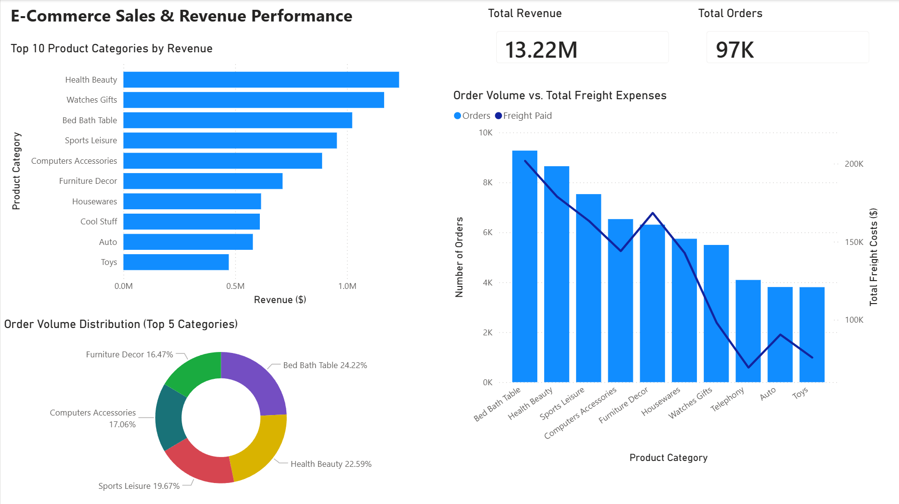
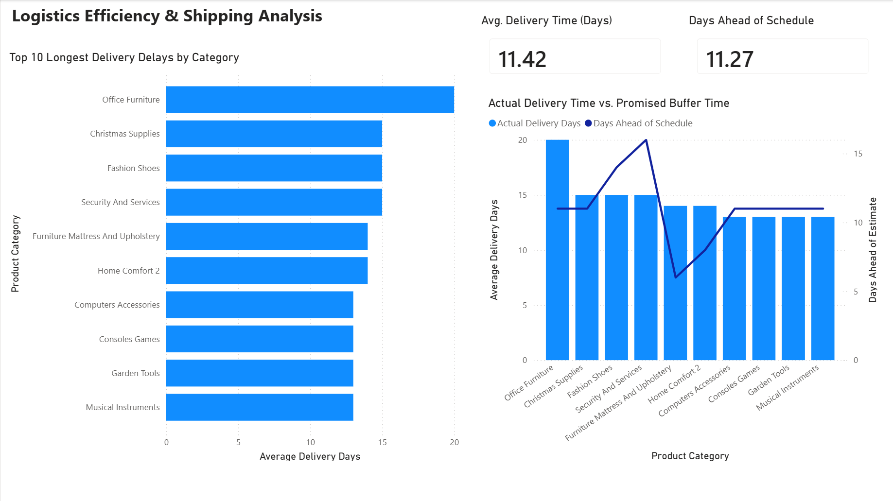
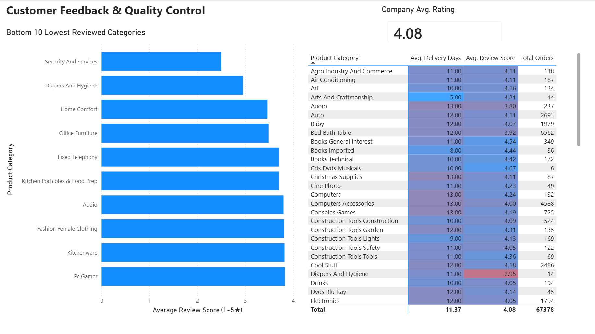

# E-Commerce Operations & Logistics Performance Dashboard

## Project Overview
This project focuses on analyzing an e-commerce operations dataset covering 97K customer orders. The objective was to clean, model, and visualize data across sales, supply chain logistics, and customer reviews to identify operational friction points that erode margins and hurt customer retention.

## Tech Stack & Data Architecture
* **Database Management:** PostgreSQL (Raw data cleaning, primary/foreign key mapping, and custom SQL views)
* **Business Intelligence:** Power BI Desktop (Star schema data modeling, DAX measures, and interactive reporting)

---

## Dashboard Breakdown & Core Insights

### 1. Sales & Revenue Performance

* **Analysis:** This view establishes our top-line business baseline ($13.22M in total revenue across 97K orders). While `Health Beauty` serves as the highest grossing revenue category, the volume distribution tells a different story: `Bed Bath Table` dominates transaction frequency, capturing 24.22% of total orders among the top-performing segments. 
* **Operational Bottleneck:** The dual-axis combo chart compares order volumes directly against freight expenses. A clear operational mismatch occurs at `Furniture Decor`—its freight costs spike disproportionately relative to its transaction volume, indicating that bulky items are heavily driving up fulfillment costs.

### 2. Logistics Efficiency & Shipping Analysis

* **Analysis:** Delivery delays are a leading cause of customer dissatisfaction. The company average delivery time sits at 11.42 days, but certain categories severely lag. `Office Furniture` is the worst operational bottleneck, taking an average of 20 days to reach customers.
* **Risk Factor:** The line chart tracks our safety cushion ("Days Ahead of Schedule"). The sharp drop for `Furniture Mattress And Upholstery` indicates that while we are technically meeting customer delivery promises, our fulfillment window has a significantly narrower margin for carrier or warehouse errors.

### 3. Customer Feedback & Quality Control

* **Analysis:** This dashboard connects logistics performance directly to customer sentiment. By isolating the bottom 10 reviewed categories, we find critical rating drops. 
* **The Core Data Link:** The performance matrix table provides concrete evidence of our core issue. Look at `Diapers And Hygiene`—it holds an alarming average review score of 2.95★. Cross-referencing this with its 11.00 average delivery days shows a direct tie between delivery delays and drop-offs in customer review ratings, rather than an issue with product quality.

---

## Actionable Recommendations
1. **Logistics Restructuring:** Renegotiate carrier agreements or shift fulfillment centers specifically for heavy categories (`Office Furniture` and `Furniture Decor`) to reduce the current 20-day delivery timeline toward the 11-day company baseline.
2. **Dynamic Delivery Expectations:** Update checkout logic to provide realistic, dynamic shipping estimates for bulky goods based on historic fulfillment times. Managing customer expectations upfront will protect review scores from dipping due to unexpected delays.
3. **Category Audit:** Investigate product quality and vendor reliability for the `Security And Services` line immediately, as it sits at the absolute bottom of customer satisfaction despite low order volumes.
